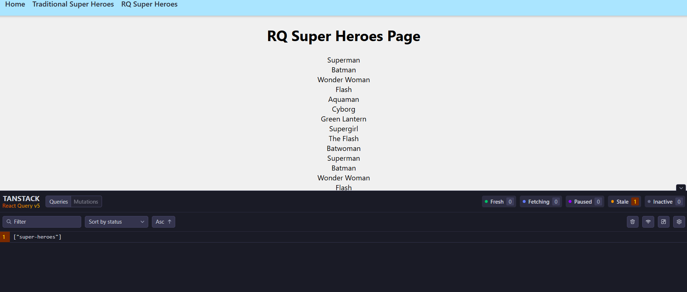

# React Query

## What is React Query?

React Query is a library for managing server state in React. It is a state management library that is used to manage the state of the server.

## Why use React Query?

- It is a state management library that is used to manage the state of the server.

## client vs server state

<u>client state</u>

client state is the state that is managed by the client.Persisted in your app memory and accessing it is asynchronous.

<u>server state</u>

server state is the state that is managed by the server.Persisted remotely and requires asynchronous API for fetching or updating.

- has shared ownership
- Data canve updated by someone else without knowledge
- UI data not be in sync with the remote data
- Challenging when you  have to deal with caching, deduping multiple requests for the same data, updating stale data in background, performance optimization, and more.

## React Query

- React Query is a library for managing server state in React.
- It is a state management library that is used to manage the state of the server.

## what i learned

<ol>
    <li>Basic Queries</li>
    <li>Poll data</li>
    <li>react query dev tools</li>
    <li>Create reusable query hook</li>
    <li>Query by ID</li>
    <li>Parallel Queries</li>
    <li>Dynamic Queries</li>
    <li>Dependent Queries</li>
    <li>Infinite Queries</li>
    <li>Paginated Queries</li>
    <li>Updating data using mutations</li>
    <li>Invalidate queries</li>
    <li>Optimistic updates</li>
    <li>Axios Interceptors</li>
</ol>

## Project setup

- new react project using CRA
- Setup an API endpoint that serves mock data for use in our application
- Set up react router and a few routers in the application
- Fetch data the traditional way using useEffect and useState

## React Query Devtools

React Query Devtools is a tool that helps you debug your React Query queries.

### Fresh:

The data is fresh and up to date.

### Fetching:

The data is being fetched from the server.

### Paused:

The query is paused.

### Stale:

The data is stale and needs to be refetched.

### Inactive:

The query is inactive.

## why staleTime is important?

StaleTime is important because it helps to improve the performance of the application.

## why staleTime must be 0?

StaleTime must be 0 because it helps to improve the performance of the application.

## refetchonMount

RefetchonMount is a feature that helps to improve the performance of the application.

- default: true

- true: the data will be refetched when the component is mounted
- false: the data will not be refetched when the component is mounted
- always: the data will be refetched when the component is mounted

## refetchOnWindowFocus

RefetchOnWindowFocus is a feature that helps to improve the performance of the application.

- default: true
- true: the data will be refetched when the window is focused
- false: the data will not be refetched when the window is focused
- always: the data will be refetched when the window is focused

## refetchInterval

RefetchInterval is a feature that helps to improve the performance of the application.

- default: false
- true: the data will be refetched every 2 seconds
- false: the data will not be refetched every 2 seconds

## refetchIntervalInBackground

RefetchIntervalInBackground is a feature that helps to improve the performance of the application.

- default: false
- true: the data will be refetched every 2 seconds
- false: the data will not be refetched every 2 seconds

## Select 

Select option to transform or select a part of the data. reteruned by the query function 

## onSuccess

onSuccess is a feature that helps to improve the performance of the application.

### Deprecated
1. OnSuccess
2. OnError
3. OnSettled
4. OnMutate
